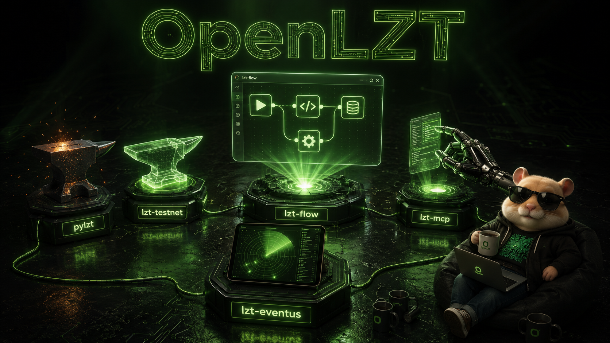
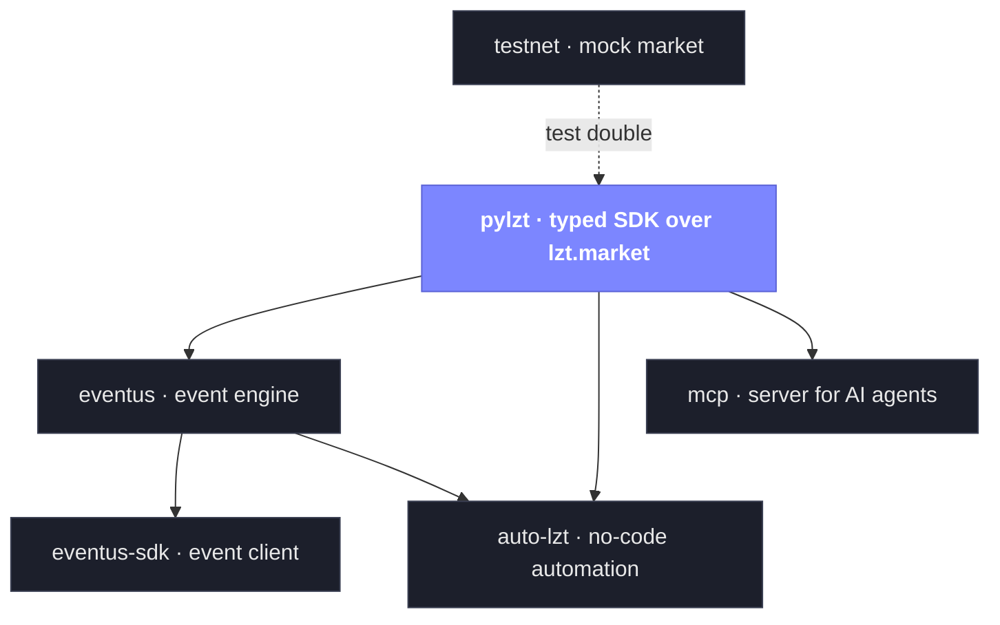

<p align="right"><b>English</b> · <a href="README.md">Русский</a></p>

<p align="center">
  
</p>

<h1 align="center">open-lzt</h1>
<h3 align="center">Open toolkit for automating <a href="https://lzt.market">lzt.market</a></h3>
<p align="center">Typed Python — from the raw API to a no-code automation engine.<br/>Self-hosted, <b>testnet by default</b>, zero real money until you flip the switch yourself.</p>

<p align="center">
  <a href="https://github.com/open-lzt/open-lzt"></a>
  
  
  
  
</p>

<br/>

### See all of it in one command

```bash
git clone --recurse-submodules https://github.com/open-lzt/open-lzt /opt/open-lzt \
  && cd /opt/open-lzt && sudo bash demo.sh
```

Brings the stand up from scratch and walks an end-to-end demo: mock market, SDK, event engine, a flow buying Steam accounts, MCP server. Every request and every response is printed as-is. Nothing touches the real market — that needs an explicit `--mode prod`.

<br/>

<table align="center">
<tr>
<td align="center" width="260"><b>Testnet by default</b><br/><sub>everything runs against a mock market — no token,<br/>no real money, no real account</sub></td>
<td align="center" width="260"><b>Fully typed</b><br/><sub>mypy --strict, 1500+ tests, DTOs at every<br/>boundary — a system, not scripts</sub></td>
<td align="center" width="260"><b>No-code automation</b><br/><sub>a task as a flow graph instead of hardcode,<br/>extended with Python plugins</sub></td>
</tr>
</table>

---

### How it fits together

Six standalone projects that stack on each other. A typed SDK at the bottom, everything else stands on it. Take one brick or the whole stand.



| Project | What it is | Read |
|---|---|---|
| **[pylzt](https://github.com/open-lzt/pylzt)** | Typed async SDK over the lzt.market / lolzteam / AntiPublic APIs — token pool, rate limits, proxies, generated from the OpenAPI spec. The foundation. | [README](https://github.com/open-lzt/pylzt#readme) |
| **[testnet](https://github.com/open-lzt/lzt-testnet)** | Mock lzt.market server. The offline double every project is tested against — no token, no real market. | [docs](https://github.com/open-lzt/lzt-testnet/tree/main/docs) |
| **[eventus](https://github.com/open-lzt/lzt-eventus)** | Event engine: poll the market → durable, replayable event log → REST / webhook / SSE / WS. | [architecture](https://github.com/open-lzt/lzt-eventus/blob/main/docs/architecture.md) |
| **[eventus-sdk](https://github.com/open-lzt/lzt-eventus-sdk)** | Async client for eventus — subscriptions, polling, webhook signature verification. | [architecture](https://github.com/open-lzt/lzt-eventus-sdk/blob/main/docs/architecture.md) |
| **[auto-lzt](https://github.com/open-lzt/auto-lzt)** | Server-side **no-code automation** engine. Describe a task ("bump my listings every hour") as a flow graph — the engine runs it. Extended with plugins. | [flow design](https://github.com/open-lzt/auto-lzt/blob/main/docs/flow-design-guide.md) · [plugins](https://github.com/open-lzt/auto-lzt/blob/main/docs/plugins.md) |
| **[mcp](https://github.com/open-lzt/lzt-mcp)** | MCP server — lets an AI agent safely drive and test the market (testnet by default, prod guarded). | [README](https://github.com/open-lzt/lzt-mcp#readme) |

---

### One-command launch

The **[open-lzt](https://github.com/open-lzt/open-lzt)** monorepo wires all six into a single `systemd` stand on one Linux host:

```bash
git clone --recursive https://github.com/open-lzt/open-lzt
cd open-lzt && sudo bash quickstart.sh
```

### Where to start

- **First time here?** → [**Why open-lzt exists**](https://github.com/open-lzt/open-lzt/blob/main/docs/WHY.en.md) — ground-up, plain-language: what it is and how to build software on lolz with it.
- **Want to run it?** → [monorepo README](https://github.com/open-lzt/open-lzt/blob/main/README.en.md) — one-command install, testnet by default.
- **Want to extend it?** → [Contributing](https://github.com/open-lzt/open-lzt/blob/main/CONTRIBUTING.en.md) — write a flow, a plugin, or send a PR to the SDK.
- **You're an AI agent?** → [Architecture map](https://github.com/open-lzt/open-lzt/blob/main/docs/ARCHITECTURE.en.md) — every repo and every link between them in one document.

<br/>

<p align="center"><sub>Built by <a href="https://github.com/zlexdev">zlexdev</a> · MIT licensed · automate responsibly, on your own accounts</sub></p>
