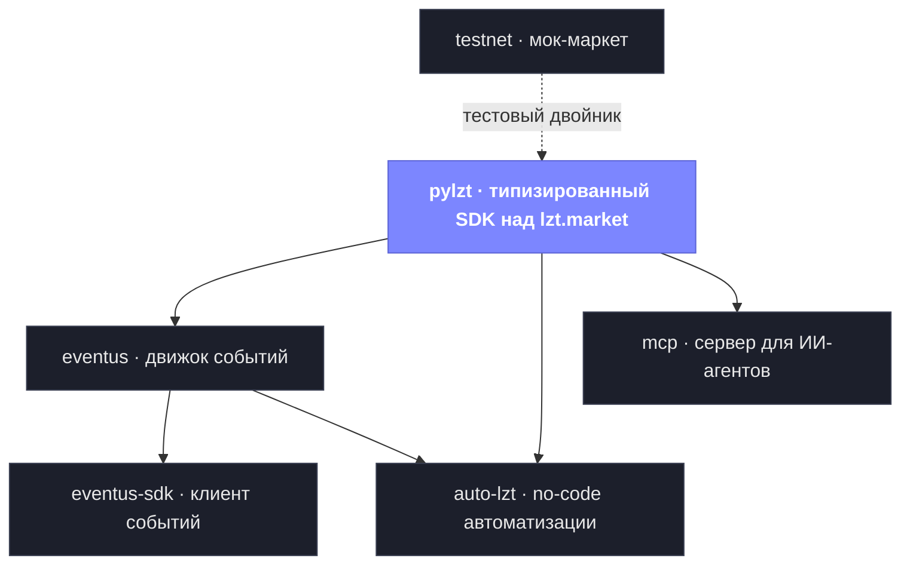

<p align="right"><a href="README.en.md">English</a> · <b>Русский</b></p>

<p align="center">
  
</p>

<h1 align="center">open-lzt</h1>
<h3 align="center">Открытый набор инструментов для автоматизации <a href="https://lzt.market">lzt.market</a></h3>
<p align="center">Типизированный Python — от «сырого» API до no-code движка автоматизаций.<br/>Свой сервер, <b>testnet по умолчанию</b>, ноль реальных денег пока сам не переключишь.</p>

<p align="center">
  <a href="https://github.com/open-lzt/open-lzt"></a>
  
  
  
  
</p>

<br/>

### Посмотреть всё за одну команду

```bash
git clone --recurse-submodules https://github.com/open-lzt/open-lzt /opt/open-lzt \
  && cd /opt/open-lzt && sudo bash demo.sh
```

Поднимает стенд с нуля и прогоняет сквозное демо: мок-маркет, SDK, движок событий, автопокупку Steam-аккаунтов флоу, MCP-сервер. Каждый запрос и каждый ответ печатается как есть. Ничего не касается реального маркета — для этого есть отдельный `--mode prod`.

<br/>

<table align="center">
<tr>
<td align="center" width="260"><b>Testnet по умолчанию</b><br/><sub>всё гоняется против мок-маркета — без токена,<br/>реальных денег и реального аккаунта</sub></td>
<td align="center" width="260"><b>Типизировано насквозь</b><br/><sub>mypy --strict, 1500+ тестов, DTO на каждой<br/>границе — не «скрипты», а система</sub></td>
<td align="center" width="260"><b>No-code автоматизации</b><br/><sub>задача как граф-флоу вместо хардкода,<br/>расширяется Python-плагинами</sub></td>
</tr>
</table>

---

### Как это устроено

Шесть самостоятельных проектов, которые складываются друг на друга. Внизу — типизированный SDK, всё остальное стоит на нём. Бери один кубик или весь стенд.



| Проект | Что это | Читать |
|---|---|---|
| **[pylzt](https://github.com/open-lzt/pylzt)** | Типизированный async-SDK над API lzt.market / lolzteam / AntiPublic — пул токенов, рейт-лимиты, прокси, сгенерирован из OpenAPI-спеки. Фундамент. | [README](https://github.com/open-lzt/pylzt#readme) |
| **[testnet](https://github.com/open-lzt/lzt-testnet)** | Мок-сервер lzt.market. Оффлайн-двойник, против которого гоняются все проекты — без токена, без реального маркета. | [docs](https://github.com/open-lzt/lzt-testnet/tree/main/docs) |
| **[eventus](https://github.com/open-lzt/lzt-eventus)** | Движок событий: опрос маркета → долговечный, воспроизводимый лог событий → REST / webhook / SSE / WS. | [архитектура](https://github.com/open-lzt/lzt-eventus/blob/main/docs/architecture.md) |
| **[eventus-sdk](https://github.com/open-lzt/lzt-eventus-sdk)** | Async-клиент к eventus — подписки, опрос, проверка webhook-подписи. | [архитектура](https://github.com/open-lzt/lzt-eventus-sdk/blob/main/docs/architecture.md) |
| **[auto-lzt](https://github.com/open-lzt/auto-lzt)** | Серверный движок **no-code автоматизаций**. Описываешь задачу («поднимай лоты каждый час») как граф-флоу — движок исполняет. Расширяется плагинами. | [дизайн флоу](https://github.com/open-lzt/auto-lzt/blob/main/docs/flow-design-guide.md) · [плагины](https://github.com/open-lzt/auto-lzt/blob/main/docs/plugins.md) |
| **[mcp](https://github.com/open-lzt/lzt-mcp)** | MCP-сервер — даёт ИИ-агенту безопасно управлять маркетом и тестировать его (testnet по умолчанию, prod под защитой). | [README](https://github.com/open-lzt/lzt-mcp#readme) |

---

### Запуск за одну команду

Монорепо **[open-lzt](https://github.com/open-lzt/open-lzt)** собирает все шесть в единый `systemd`-стенд на одном Linux-хосте:

```bash
git clone --recursive https://github.com/open-lzt/open-lzt
cd open-lzt && sudo bash quickstart.sh
```

### С чего начать

- **Впервые здесь?** → [**Зачем нужен open-lzt**](https://github.com/open-lzt/open-lzt/blob/main/docs/WHY.md) — разбор с самых азов, простым языком: что это и как на этом строить софт под lolz.
- **Хочешь запустить?** → [README монорепо](https://github.com/open-lzt/open-lzt/blob/main/README.md) — установка одной командой, testnet по умолчанию.
- **Хочешь расширять?** → [Контрибуция](https://github.com/open-lzt/open-lzt/blob/main/CONTRIBUTING.md) — напиши флоу, плагин или пришли PR в SDK.
- **Ты ИИ-агент?** → [Карта архитектуры](https://github.com/open-lzt/open-lzt/blob/main/docs/ARCHITECTURE.md) — все репозитории и все связи между ними в одном документе.

<br/>

<p align="center"><sub>Сделал <a href="https://github.com/zlexdev">zlexdev</a> · лицензия MIT · автоматизируй с умом и на своих аккаунтах</sub></p>
