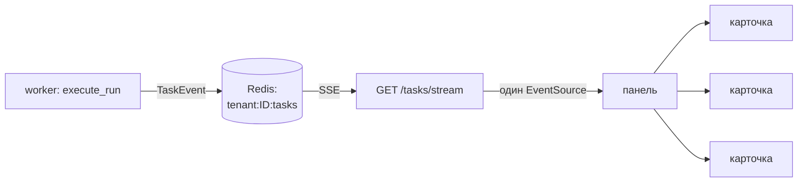

# Панель auto-lzt — как устроена

Глава к [ARCHITECTURE.md](ARCHITECTURE.md). Там — карта шести репозиториев; здесь — только панель.

Панель показывает задачи по расписанию и даёт по ним действовать.

Задача = флоу + его расписание.

---

## Утверждение

**Стоимость панели не растёт с числом карточек.**

Три части, каждая проверяется тестом:

- список задач — одна проекция, а не запрос на карточку;
- обновления — одно соединение, а не соединение на карточку;
- страницы — keyset, а не OFFSET.

Каждое из трёх ниже названо вместе с тестом, который его держит.

---

## Поток события



Worker публикует **TaskEvent** в трёх точках: запуск начался, запуск кончился, задача изменилась.

Не на каждом шаге — карточка показывает жизненный цикл задачи, а не прогресс внутри запуска.

Канал один на установку: `tenant:<id>:tasks`.

Браузер держит один `EventSource`; какую карточку перерисовать, решает клиент по `flow_id` события.

---

## Проекция вместо таблицы

Таблицы `tasks` нет.

Задача — это **вычисляемое соединение** трёх таблиц: `flows ⋈ triggers ⋈ runs`.

Почему не завести таблицу: она была бы копией, которую надо синхронизировать при каждом запуске, и рассинхрон был бы не виден.

Последний запуск каждого флоу достаётся оконной функцией:

```sql
ROW_NUMBER() OVER (PARTITION BY flow_id ORDER BY created_at DESC, id DESC)
```

**Не `LATERAL`** — в SQLite его нет, а на SQLite гоняются тесты.

**Запомнить:** число запросов на страницу — **2**, независимо от числа задач.

Держит: `tests/integration/test_task_projection.py`.

---

## Три свойства и их тесты

| Свойство | Тест |
|---|---|
| Число запросов не растёт с числом задач | `tests/integration/test_task_projection.py` |
| Ровно один `EventSource` при 20 карточках и серии событий | `frontend/src/panel/useTaskStream.test.tsx` |
| Keyset-пагинация, не OFFSET | `tests/integration/test_task_routes.py` |
| Кадр SSE доходит **через nginx** | `tests/e2e/test_sse_through_nginx.py` |
| Поток переживает простой, а не умирает после первого heartbeat | `tests/unit/test_sse_frames.py` |
| Слот потока освобождается при обрыве | `tests/e2e/test_task_stream_over_http.py` |

Про последние три — ниже, они не про масштаб, а про то, что живое соединение вообще живое.

---

## Почему тесты против настоящего сокета

Все обычные тесты API гоняются через `httpx.ASGITransport`.

Он **не** делает настоящий HTTP: не режет на chunk'и, не флашит, не рвёт сокет.

То есть он доказывает, что генератор отдаёт правильные строки — и ничего не говорит о том, дойдут ли они до браузера.

Разрыв между этими двумя утверждениями стоил трёх настоящих багов:

1. **Поток умирал после первого heartbeat.**
   `asyncio.wait_for` отменяет то, что ждёт. Ждал он `__anext__` подписки — отмена закрывала генератор.
   В проде `EventSource` молча переподключается, поэтому это выглядело как работающая панель.
   На деле — переподключение каждые 15 секунд, то есть отрицание «одного соединения».

2. **Дев-сервер не публиковал события вообще.**
   `event_transport` не передавался и дефолтился в `None`. Карточки не обновлялись, причина ниоткуда не видна.

3. **Протухший токен терял разрыв.**
   `EventSource` не умеет ставить заголовки, поэтому после перевыпуска токена клиент возобновлялся «с текущего момента».

Ни один из трёх не ловился 600 существующими тестами.

---

## Токен потока: разделение по ключу, не по полю

`EventSource` не умеет слать заголовок `X-API-Key`.

Поэтому поток авторизуется коротким токеном в query — минута жизни, HMAC.

Область (`run` / `tenant`) разделена **выводом разного ключа**, а не полем внутри payload:

```
HKDF(master_key, info=b"lzt-flow/sse-stream-token/v1")         -> run
HKDF(master_key, info=b"lzt-flow/sse-tenant-stream-token/v1")  -> tenant
```

**Ловушка:** если бы область была полем в payload, забытая проверка этого поля делала бы токены взаимозаменяемыми — и подпись при этом сходилась бы.

При выводе ключа подпись чужой области просто не проверяется. Забыть нечего.

Держит: `tests/e2e/test_task_stream_over_http.py::test_a_run_scope_token_cannot_open_the_tenant_stream`.

---

## Что НЕ переиспользовано и почему

**lzt-eventus** производит события **рынка**: новый заказ, продажа, изменение цены.

Панели нужны события **задачи**: запуск начался, таймер сдвинулся.

Это разные слои, а не недосмотр. Задача может ни разу не коснуться рынка и всё равно менять свою карточку.

---

## Границы, которые не перейдены

Каждая — реальная несостыковка, которую судья найдёт сам. Называем первыми.

**Плагин даёт вкладку и бэкенд, но не свой UI-бандл.**
Вкладки приходят из `GET /panel/tabs`, встроенные и плагинные — одним списком.
Но код вкладки живёт во фронтенде и резолвится по ключу.
Настоящая доставка UI из плагина требует Module Federation или собственного DSL. Контракт понятен, цена высокая — не построено.

**Мультиарендность структурная, а не граница безопасности.**
`tenant_id` есть в каждой таблице и в каждом методе репозитория, но токен потока привязан к установке.
Одна установка — один оператор.

**SSE через прокси проверен на одной конфигурации nginx.**
Той, которую ставит `install.sh`. За другим прокси — не проверено.

**LiveBadge всё ещё опрашивает раз в 5 секунд.**
Рядом с архитектурой «один мультиплексированный поток» это выглядит несостыковкой. Почему так:
он per-flow, живёт внутри конструктора за флагом, и `/tasks/list` — per-trigger.
Флоу **без** триггера не проецируется ни в какую задачу, то есть потоком его обслужить нельзя в принципе.
«Один поток» относится к экрану задач, а не к каждому живому индикатору в приложении.

**`/tasks/list` — единственный пагинированный эндпоинт.**
`/runs/list`, `/accounts/list`, `/flows/list`, `/triggers/list` возвращают коллекцию целиком.
У `/runs/list` та же форма неограниченного роста. Здесь не исправлено.

**Лимит поднятий закодирован в графе, а не в рантайме.**
Пресет вставляет узел `logic.take`, который режет список лотов.
Собранный руками флоу без этого узла лимита не имеет вовсе.
Это свойство пресета, а не движка.

**Лимит — на один запуск, а не скользящая квота за час.**
У движка нет предиката, которым граф мог бы прочитать историю запусков. Темп задаёт cron.
Форма говорит это прямым текстом, чтобы не обещать гарантию, которой граф не даёт.

**Ограничение одновременных потоков покрывает только `/tasks/stream`.**
У `/runs/{id}/stream` его сегодня нет; механизм написан переиспользуемым, подключение — одна строка.

---

## Один новый узел

Пресет поднятия задумывался как чистая композиция: ноль новых узлов, только то, что движок уже умеет.

Не сошлось.

`for_each_lot` разворачивается по **всему** списку, который ему дали. Ни один существующий узел не умел ни отрезать первые N, ни посчитать запуски в окне.

То есть «поднимать не больше N лотов за запуск» было **невыразимо** графом.

Добавлен один узел — `logic.take`: первые N элементов JSON-списка.

Намеренно общий примитив, а не autobump-узел: он ничего не знает про лоты и поднятия.
`get-my-lots → take → for-each-lot` и любой будущий `что-то-списочное → take → цикл` — одна форма.

Тест `tests/unit/test_autobump_preset.py` проверяет состав графа **против настоящего реестра узлов**, а не против списка в тесте.
